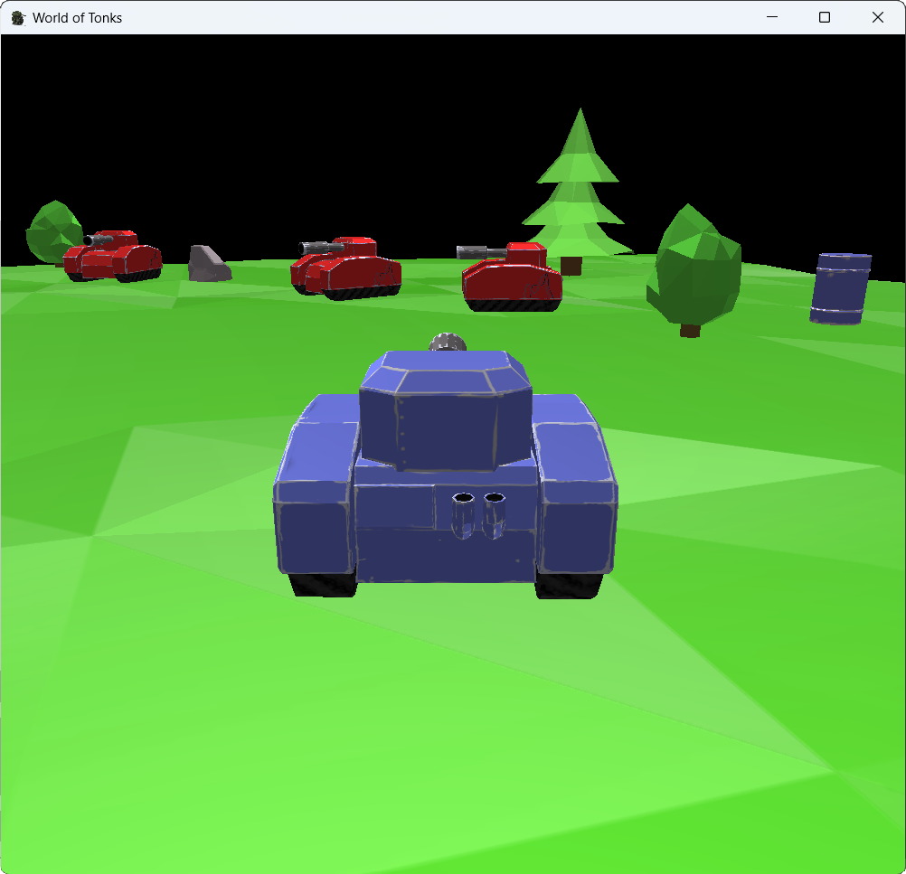
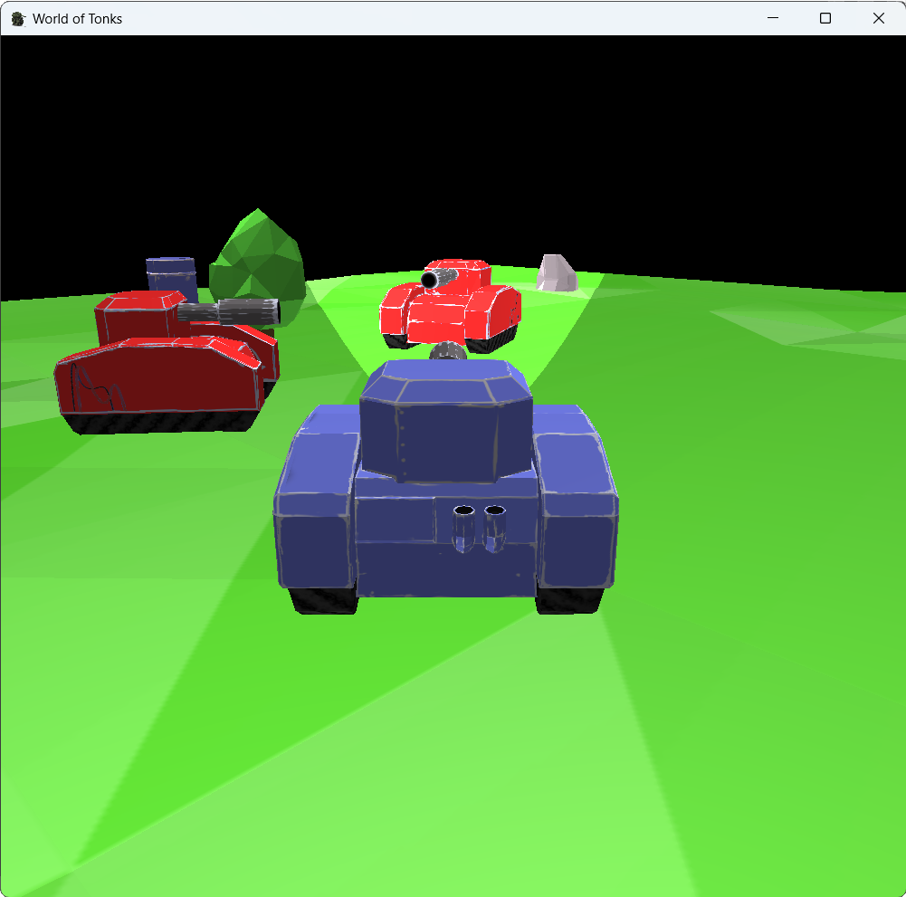

# Индивидуальное задание № 3. Мир танка
## Задание
В поле стоит танк и новогодняя ёлка, камера располагается сзади сверху танка, проекция — перспективная. Предусмотреть модели и текстуры для ёлки, поля и самого танка. На сцене присутствует глобальное освещение — направленный источник света.

Дополнительно:
- В поле находится несколько моделей — противники и декорации (не меньше одного вида противника и двух видов декораций, расположение генерируется случайным образом).
- Танк ездит по полю (управление с клавиш).
- Камера следует за танком (вид о третьего лица)
- Добавить танку фары (прожекторные источники освещения). Источники света фар должны двигаться вместе с танком (фары можно включить и выключить кнопками с клавиатуры).
- Танк умеет выпускать снаряды - объекты со светящимся материалом, летящие вперёд.
- Когда снаряд сталкивается с противником, они исчезают. Для проверки столкновения двух объектов сравниваем расстояние между центрами этих объектов с суммой двух радиусов (у объекта есть радиус столкновения).

## Демонстрация работы

